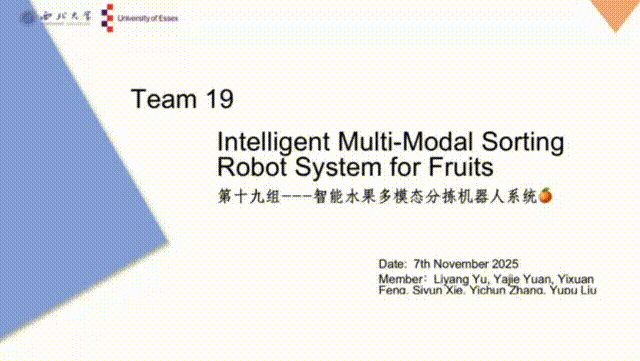

<div align="center">

# Intelligent Multimodal Fruit Sorting Robot

**A multimodal robotic sorting system integrating visual perception, offline voice interaction, command understanding, and robotic-arm control.**

`Vision` · `Speech` · `Interaction` · `Robotics` · `GUI`

</div>

---

## System Demo

<p align="center">
  
</p>

<p align="center">
  <strong>Voice command → target recognition → visual verification → robotic-arm grasping</strong>
</p>

<p align="center">
  <a href="assets/demo/system_demo.mp4">View the full-quality demo video</a>
</p>

---

## Overview

This project implements an integrated **perception–decision–execution** pipeline for intelligent fruit sorting.

The system receives an offline voice command, maps it to a target fruit, performs camera-based YOLO detection, verifies the target, and triggers a robotic-arm pickup sequence through serial communication.

### Workflow

```text
Offline Voice Command
        ↓
Command Parsing
        ↓
YOLO Visual Detection
        ↓
Target Verification
        ↓
Robotic-Arm Control
        ↓
Automatic Grasping & Sorting
```

---

## Core Modules

| Module | Role | Main Technology |
|---|---|---|
| 👁️ **Vision** | Fruit detection, image acquisition, ONNX inference | YOLO, OpenCV, ONNX Runtime |
| 🎙️ **Speech** | Offline voice-command reception | Serial communication |
| 💬 **Interaction** | Command mapping and target dispatch | Queue-based task coordination |
| 🤖 **Robot** | Robotic-arm motion and grasping | Serial bus servo control |
| 🖥️ **GUI** | Camera feed, logs, system status | Tkinter |
| ⚙️ **Configuration** | Hardware ports, camera index, model path | YAML / Python |

> The complete integrated runtime is kept in `main.py` to preserve the original working hardware workflow.  
> Supporting modules are organized by function for clarity and future modularization.

---

## Project Highlights

| Item | Result |
|---|---:|
| Detection mAP@50 | **0.99499** |
| Average detection time | **181.2 ms** |
| Evaluation images | **500** |
| Robotic-arm grasping success rate | **95.7%** |
| Grasping trials | **50** |

---

## Supported Commands

The current system supports target-directed sorting for:

- 🍎 **Apple**
- 🍊 **Orange**
- 🍐 **Pear**

---

## 📁 Repository Structure

```text
Intelligent-Multimodal-Fruit-Sorting-Robot/
│
├── main.py                      # Integrated system entry point
├── vision/                      # YOLO / image perception / ONNX
│   ├── model/best.onnx
│   ├── onnx_inference.py
│   ├── export_onnx.py
│   ├── simplify_onnx.py
│   ├── hand_detection.py
│   └── model_test.py
│
├── speech/                      # Offline speech interface
├── audio/                       # Audio-related extension interface
├── interaction/                 # Command parsing and task dispatch
├── robot/
│   └── arm_controller.py        # Robotic-arm control
├── gui/                         # GUI-related documentation / extension
│
├── training/
│   └── train_yolo.py
├── tools/
│   └── check_annotations.py
├── configs/
│   └── hardware.example.yaml
│
├── assets/
│   ├── images/                  # Result figures
│   └── demo/
│       ├── system_demo.gif
│       └── system_demo.mp4
│
├── requirements.txt
├── README.md
├── .gitignore
└── LICENSE
```

The repository is organized by **function**, while `main.py` preserves the complete integrated runtime so that the hardware-dependent workflow remains easy to understand and reproduce.

---

## Quick Start

### 1. Install dependencies

```bash
pip install -r requirements.txt
```

### 2. Check hardware configuration

Update the serial ports and camera index to match the connected devices.

Reference configuration:

```text
configs/hardware.example.yaml
```

### 3. Run the system

```bash
python main.py
```

---

## Hardware Interfaces

| Component | Default Interface |
|---|---|
| Offline voice module | `COM8`, 9600 baud |
| Robotic-arm controller | `COM13`, 9600 baud |
| Camera | Index `1` |
| Detection model | `vision/model/best.onnx` |

These values may need to be changed for another computer or hardware setup.

---

## Main Runtime

`main.py` integrates the complete system workflow:

- voice-command reception;
- command-to-fruit mapping;
- real-time camera acquisition;
- YOLO-based target detection;
- target verification;
- GUI visualization and status display;
- robotic-arm serial communication;
- automatic pickup-cycle execution;
- multithreaded coordination between perception and control.

---

## Model and Utilities

The final ONNX detector is stored at:

```text
vision/model/best.onnx
```

Additional utilities are provided for:

- ONNX inference;
- PyTorch-to-ONNX export;
- ONNX simplification;
- hand-detection experiments;
- model testing;
- annotation visualization;
- YOLO training.

---

## Design Principle

The repository is organized by function while keeping the original integrated runtime intact.

This avoids unnecessary refactoring of hardware-dependent logic while making the project easier to read, reproduce, extend, and present.

---

## License

See [`LICENSE`](LICENSE).
